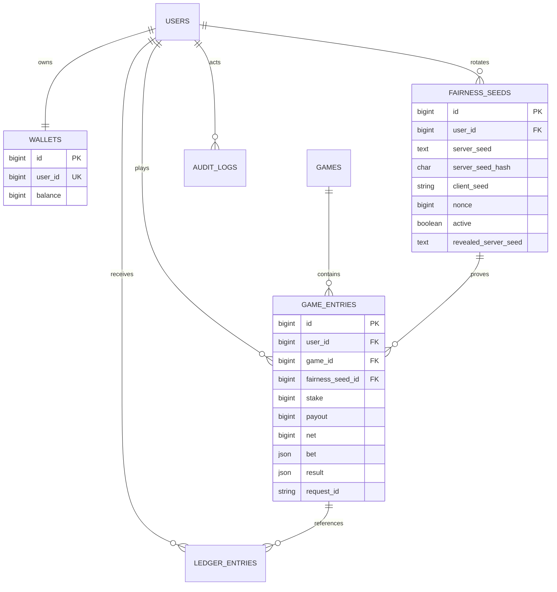

# ERD rút gọn

```mermaid
erDiagram
    USERS ||--|| WALLETS : owns
    USERS ||--o{ FAIRNESS_SEEDS : rotates
    USERS ||--o{ GAME_ENTRIES : plays
    USERS ||--o{ LEDGER_ENTRIES : receives
    GAMES ||--o{ GAME_ENTRIES : contains
    FAIRNESS_SEEDS ||--o{ GAME_ENTRIES : proves
    GAME_ENTRIES ||--o{ LEDGER_ENTRIES : references
    USERS ||--o{ AUDIT_LOGS : acts

    WALLETS {
        bigint id PK
        bigint user_id UK
        bigint balance
    }

    FAIRNESS_SEEDS {
        bigint id PK
        bigint user_id FK
        text server_seed
        char server_seed_hash
        string client_seed
        bigint nonce
        boolean active
        text revealed_server_seed
    }

    GAME_ENTRIES {
        bigint id PK
        bigint user_id FK
        bigint game_id FK
        bigint fairness_seed_id FK
        bigint stake
        bigint payout
        bigint net
        json bet
        json result
        string request_id
    }
```
